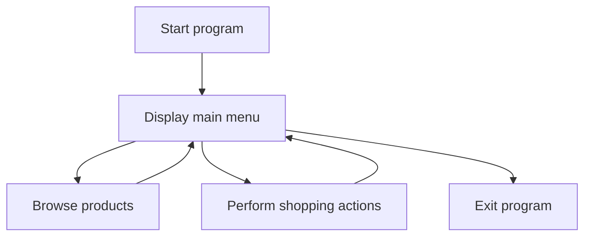

A console-based e-commerce prototype written in C++. This academic project demonstrates fundamental programming concepts through a simple shopping workflow.

## Project Overview

The system provides a text-based interface for interacting with products and performing basic e-commerce operations.

### Main Features

- Product listing
- Menu-based user interaction
- Text-file data handling
- Basic shopping workflow
- Feedback and product-list file integration

The main implementation is contained in `Group20.cpp`.

## Program Flow



## Repository Contents

| File | Description |
|---|---|
| `Group20.cpp` | Main C++ implementation |
| `LIST.txt` | Product or list data used by the program |
| `FEEDBACK.txt` | Project feedback or evaluation notes |

## How to Compile

A C++17-compatible compiler is recommended.

```bash
g++ -std=c++17 Group20.cpp -o ecommerce
./ecommerce
```

On Windows PowerShell:

```powershell
g++ -std=c++17 Group20.cpp -o ecommerce.exe
.\ecommerce.exe
```

## Learning Outcomes

This project demonstrates experience with:

- C++ programming
- Console user-interface design
- File handling
- Control flow
- Collections and data processing
- Basic e-commerce system design

## Limitations

This is an academic console-based prototype. It does not include:

- Web frontend
- Database integration
- User authentication
- Online payment processing
- Cloud deployment
- Production-level security

## Tech Stack

C++
